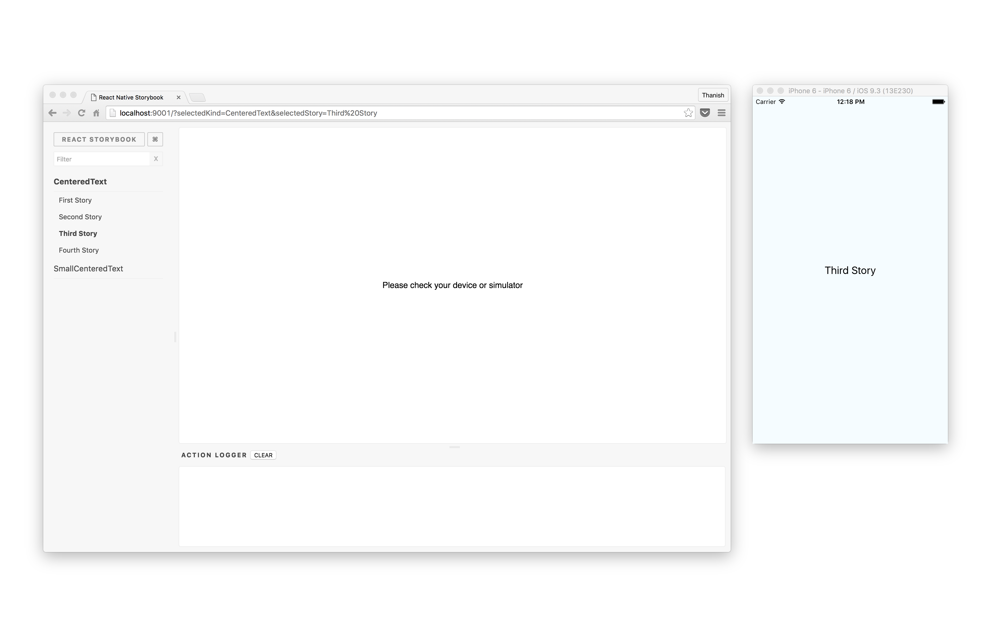

# React Native Storybook

With React Native Storybook you can design and develop individual React Native components without running your application.



## Installing Storybook

First, install the package from the *npm* registry and copy initial set of files

```shell
npm i -D @kadira/react-native-storybook
cp -r ./node_modules/@kadira/react-native-storybook/assets/template ./storybook
```

Edit *index.ios.js* file and the *index.android.js* file to set your root component name when calling `AppRegistry.registerComponent`. And add the storybook npm script to the *scripts* section of your *package.json* file.

```json
{
  "start": "node node_modules/react-native/local-cli/cli.js start",
  "storybook": "storybook start -p 9001"
}
```

## Writing Storybook Stories

Now you can write stories to preview and interact with your components. These story files can be placed almost anywhere within your project directory.

```jsx
import React from 'react';
import { storiesOf } from '@kadira/react-native-storybook';
import ExampleComponent from '../../components/ExampleComponent';

storiesOf('ExampleComponent')
  .add('First Story', () => (
    <ExampleComponent foo="bar">First Story</ExampleComponent>
  ));
```

After writing stories, they must be imported into the storybook by requiring them inside the *storybook/config.js* file. Check the [react-native-button](https://github.com/kadira-samples/react-native-button) repo for an example.

## Starting Storybook (fast)

The fastest way to start storybook is to temporarily load it from your main `index.ios.js` and `index.android.js` files. When you want to run the storybook insert this line and comment out the rest of the file.

```javascript
import './storybook';
```

Start the react-native debug server

```shell
npm run start
```

Start the storybook server

```shell
npm run storybook
```

And start your android/ios device or simulator. Stories will appear on http://localhost:9001 as soon as your device connects successfully.

## Starting Storybook (advanced)

There are a couple of drawbacks with the previous method.

- Both your react native application and the storybook use the same app name. Because of this, only one of them can exist on a device at any given moment.
- Should edit *index.__.js* files when switching between the app and the storybook.

React Native Storybook can be run without making changes to your *index.__.js* files but it'll take a few minutes to set it up.

- [Setup React Native Storybook with iOS](#)
- [Setup React Native Storybook with Android](#)

## Connecting Devices

In order to work with React Native Storybook, one or more devices should be connected. Stories will only show when devices are available. At the moment, remote javascript debugging should also be enabled for storybook to work [#3](https://github.com/kadirahq/react-native-storybook/issues/3).

### iOS simulator

- Start with `react-native run-ios`
- Open the debugger menu `CMD+D`
- Enable remote javascript debugging

### Android emulator

- Get your AVD name with `emulator -list-avds`
- Start the emulator `emulator -avd MY_AVD_NAME`
- Forward port 8081 `adb reverse tcp:8081 tcp:8081`
- Forward port 9001 `adb reverse tcp:9001 tcp:9001`
- Start with `react-native run-android`
- Open the debugger menu `adb shell input keyevent 82`
- Enable remote javascript debugging

### Android device

- Connect your device with adb
- Forward port 8081 `adb reverse tcp:8081 tcp:8081`
- Forward port 9001 `adb reverse tcp:9001 tcp:9001`
- Start with `react-native run-android`
- Open the debugger menu `adb shell input keyevent 82`
- Enable remote javascript debugging
